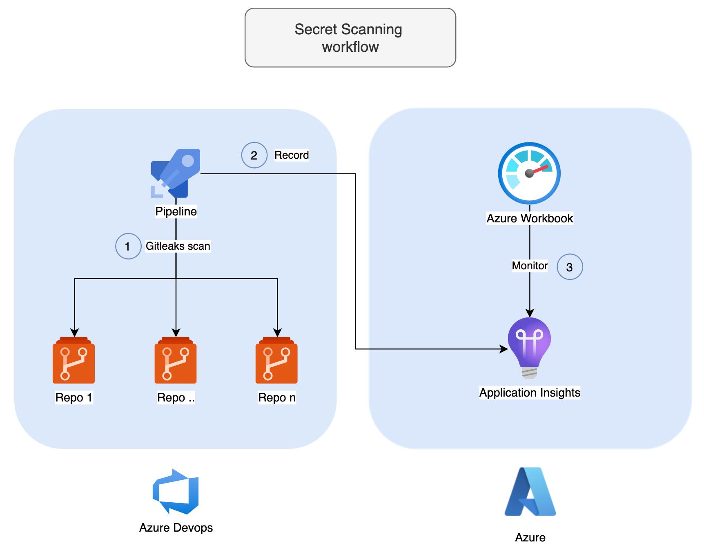

# Introduction

In [this article](https://techcommunity.microsoft.com/t5/azure-developer-community-blog/monitor-git-secrets-on-azure-devops-with-gitleaks/ba-p/3998673?WT.mc_id=DOP-MVP-5003548) we will see how to scan all repos of an Azure DevOps project.

The secret scanning solution will respect the following guidelines:

- 1 single DevOps pipeline per DevOps project that launches Gitleaks and sends its scan results to an Azure Application Insights.
- This pipeline can be triggered manually for a spot check or through any supported scheduled triggers provided by Microsoft.
- Developers are able to declare a secret as a false positive following Gitleaks procedure.
- 1 Azure monitoring Workbook where you can find:

1. An overview tab that displays the total number of secrets found
2. A "Secrets" tab which gives more metrics such as

- The secret trends -> number of secrets observed during each audit
- Count of secrets per repository
- A complete inventory of results exportable to Excel

